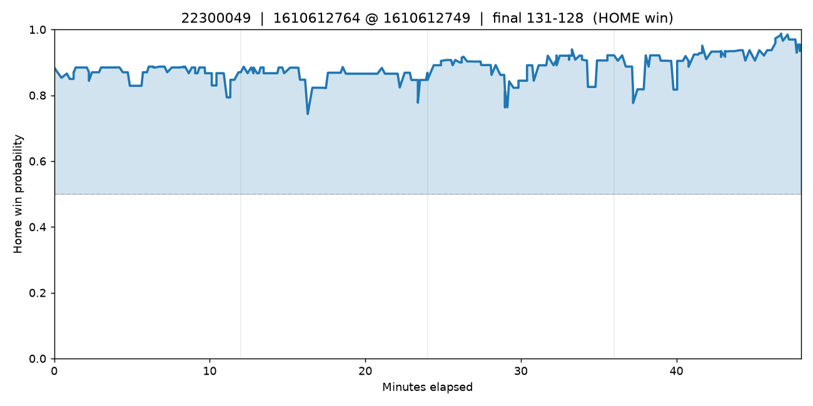
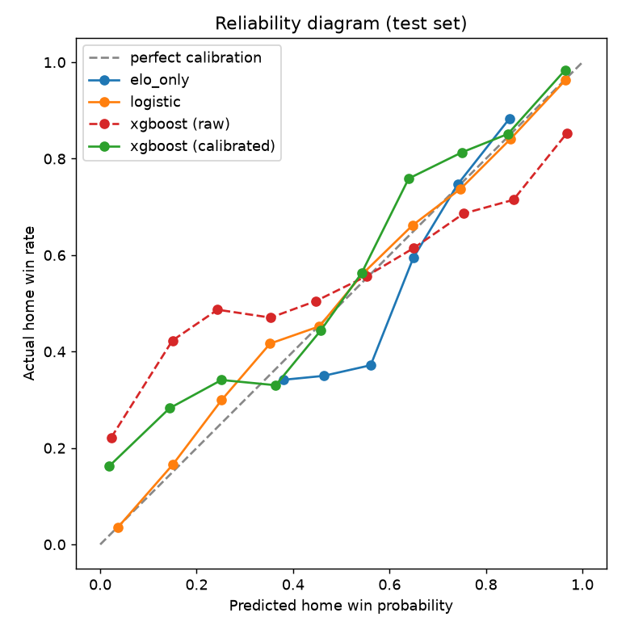

# NBA Win Probability

A calibrated win-probability model for NBA games. Given the live state of a game
— score margin, time remaining, and pregame team strength — it estimates the
probability that the home team wins, at every moment of the game.

The point of the project isn't to beat Vegas. It's **rigor**: an honest backtest
with no data leakage, and a model whose probabilities are *calibrated* — when it
says 70%, the home team really does win about 70% of the time.

> Win probability is **tabular** data, so the model is gradient-boosted trees
> (XGBoost) — the same approach as nflfastR's NFL model. It trains in seconds on
> a laptop CPU; no GPU required.

## The live win-probability curve

The headline output: replay any game and watch P(home win) move with every swing.



*Chart rendered from a real 2024-25 NBA game. Regenerate with `python src/plot_game.py`.*

## Is it actually calibrated?

A reliability diagram plots predicted probability against the actual win rate.
Points on the diagonal = perfectly calibrated.



## Results

`python src/model.py` prints a metrics table and writes `outputs/summary.json`.
It compares the model against three honest baselines:

| model | log-loss | Brier | accuracy | what it knows |
|---|---|---|---|---|
| naive | 0.6868 | 0.2468 | 55.7% | nothing — always predicts the base home-win rate |
| elo_only | 0.6567 | 0.2327 | 58.9% | pregame team strength only (ignores the live game) |
| logistic | **0.5030** | **0.1707** | **73.0%** | score margin + time (the classic simple model) |
| xgboost (raw) | 0.7087 | 0.2170 | 70.2% | all features, no calibration |
| xgboost (calibrated) | 0.5842 | 0.1914 | 70.6% | all features + isotonic calibration wrapper |

Lower log-loss and Brier = better; calibration is the primary goal.

Numbers from a real backtest: train on 2023-24 (146,008 play-by-play moments),
test on 2024-25 (147,878 moments). Generated by
`python src/model.py --data data --test-seasons 2024-25`.

> **What the table shows:** Raw XGBoost is overconfident at the tails — log-loss 0.7087,
> *worse* than guessing the base rate (0.6868). Adding `CalibratedClassifierCV(isotonic)`
> — fit on training data only, no test leakage — drops log-loss to 0.5842 and beats naive
> decisively. Logistic regression still leads on both metrics with a single season of
> training data; it can't extrapolate wildly and so never gets burned by overconfidence.
> The calibrated XGBoost is the model used going forward.

## Win Probability Added (the fun part)

Once the model is calibrated, every play has a *win-probability swing*. The
biggest swings toward the eventual winner are the clutchest moments of the
season. With real play-by-play (which carries a player per event), `wpa.py` also
ranks **players by total Win Probability Added** — the same idea as nflfastR's
EPA/WPA leaderboards, turned into stories.

```
python src/wpa.py --top 15
```

## Player points projection (a separate model)

A second, independent model under `src/player_points/` projects how many points
a player will score in an upcoming game — as a **distribution**, not a single
number. It predicts an expected value plus an **80% prediction interval** using
three XGBoost quantile regressors (mean, 10th percentile, 90th percentile).

The same rigor applies. Features are leakage-safe (every rolling window is
shifted so a game never sees its own box score; opponent and teammate features
use only prior games; cold-start gaps are left as NaN for XGBoost rather than
filled from a season-wide mean, which would peek at the future). The backtest
trains on **four seasons (2020-21 … 2023-24)** and tests on **2024-25**, with no
player-game in both sets.

| model | MAE | 80% coverage | interval width |
|---|---|---|---|
| naive (season avg to date) | 4.68 | — | — |
| xgboost (mean + 80% interval) | 4.57 | 79.5% | 14.4 pts |

*Real backtest: 569 test players, 108,384 train rows → 28,110 test rows.
Generated by `python src/player_points/model.py --data data`.*

**Features** (importance, points model): `pts_roll10` (0.38), `usage_roll5`
(0.28), `pts_season_avg` (0.21), then `pred_minutes` from a **minutes
sub-model** (0.07) and `top2_teammate_out` from the leakage-safe
teammate-availability proxy (0.02). Opponent pace / defensive rating / defense-
vs-position and the pregame blowout proxy each contribute ~0.003 — small, but
included and reported honestly. Interval coverage is now spot-on (79.5% vs the
80% target), up from 77.9% on the old one-season model.

```bash
python src/data/export_player_points.py        # 5 seasons parquet -> csv
python src/player_points/model.py --data data  # train + backtest
python src/player_points/predict.py --player "Stephen Curry" --opp-team BOS
# → Expected: ~22 pts  |  80% interval ~14–32 pts
```

### Over / under (informational only — **not betting advice**)

Given a *distribution* instead of a point estimate, you can ask: what's the
chance a player goes over a line? We approximate the projected points as Normal
and read the probability off it:

- `sigma = (q90 − q10) / 2.563` — an 80% interval spans ~2.563 std devs, so the
  interval the model already produces *is* the spread.
- `P(over L) = 1 − Φ((L − mean) / sigma)` via `math.erf` (`src/player_points/odds.py`).
- `P(over)` is then **isotonic-calibrated** (fit on train only) to remove the
  raw model's overconfidence.

> **The line is the player's own season average to date — NOT a Vegas line.** So
> the bet is really "will they beat their own running average tonight?" The only
> edge is the *deviation* signal (recent form, usage trend, a star teammate
> sitting). A real sportsbook line already prices most of that in, so these
> numbers do **not** transfer to beating a book.

**Selective coverage** is the honest way to read it: don't grade every call,
grade only the most confident ones. Train 2020-21…2023-24, test 2024-25
(27,541 calls). `python src/player_points/backtest_overunder.py`:

| slice | coverage | hit rate |
|---|---|---|
| top 5% most-confident | 5% | **0.754** |
| top 10% | 10% | 0.716 |
| top 25% | 25% | 0.667 |
| top 50% | 50% | 0.626 |
| **all calls** | 100% | **0.579** |

vs naive baselines: always-Over 0.473, coin flip 0.500. Probabilistic quality
beats naive too (Brier 0.240 vs 0.249, log-loss 0.675 vs 0.692).

> **Why not 80% overall?** Because that's impossible without leakage. The line is
> the player's own average, so ~58% overall is already a real edge from the
> deviation signal — and the backtest has a hard tripwire that flags any overall
> hit rate above 63% as a **leakage bug, not a win**. The ~75% on the top-5%
> most-confident slice is where the usable signal concentrates, reported with the
> count so you see how few games that is. Still informational only.

```bash
python src/player_points/predict.py --player "Stephen Curry" --opp-team BOS --line 24.5
# → Projected ~22 | Line 24.5 | Over ~36% / Under ~64%
python src/player_points/backtest_overunder.py     # coverage curve + leakage tripwire
```

## Quickstart

```bash
python -m venv .venv && source .venv/bin/activate
pip install -r requirements.txt

# Option A — try the whole pipeline instantly on synthetic data (no network):
python src/synth.py                  # writes data/games.csv + data/moments.csv
python src/model.py --data data      # train + metrics + reliability diagram
python src/plot_game.py              # the win-prob curve
python src/wpa.py                    # clutch-play leaderboard

# Option B — real NBA data (run on your laptop; stats.nba.com blocks CI IPs):
python src/fetch_data.py --seasons 2024-25 --games 300
python src/model.py --data data --test-seasons 2024-25
# later, 5 seasons:
python src/fetch_data.py --seasons 2020-21 2021-22 2022-23 2023-24 2024-25 --games 400
```

## How leakage is avoided

- **Elo team strength is computed chronologically** — each game's rating uses
  only games that finished earlier (`src/elo.py`).
- **Every in-game feature is available at that moment** — score margin, seconds
  left, period. The final score is never an input.
- **Test seasons are fully held out** — no game is in both train and test.

## Layout

```
src/synth.py        synthetic data for offline dev (same schema as real)
src/fetch_data.py   real data via nba_api (5 seasons)
src/elo.py          leakage-safe chronological Elo
src/features.py     features + season-based train/test split
src/model.py        XGBoost + baselines + calibration
src/plot_game.py    live win-probability curve
src/wpa.py          Win Probability Added leaderboard
app.py              Streamlit dashboard (win-prob curve, WPA, player props)

src/player_points/  SEPARATE points-projection model (distribution, not a point)
  fetch_gamelogs.py   bulk PlayerGameLogs via nba_api (2 API calls / 2 seasons)
  features.py         leakage-safe rolling / opponent / rest features
  model.py            three XGBoost quantile regressors + backtest
  predict.py          CLI: project one player or top-N scorers vs an opponent
  odds.py             over/under probabilities from the projected distribution
  news.py             stubbed injury/lineup feed — the documented next step
```

## Roadmap

- **Player & lineup features** — on-court lineup strength from substitution
  parsing, layered on top of the team-level Elo.
- **Deep-learning bake-off** — a sequence model (LSTM/Transformer) over the
  play-by-play sequence, compared head-to-head with XGBoost on the *same*
  calibrated backtest. This is the honest place a GPU earns its keep, and the
  comparison ("did deep learning actually beat the gradient-boosted tree?") is
  itself the interesting result.
- **Streamlit demo** — pick a game, watch the curve build.

## License

MIT © Tirth Suba
